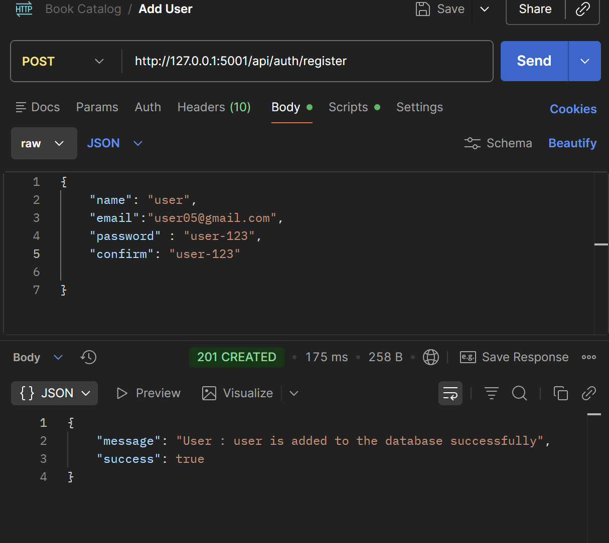
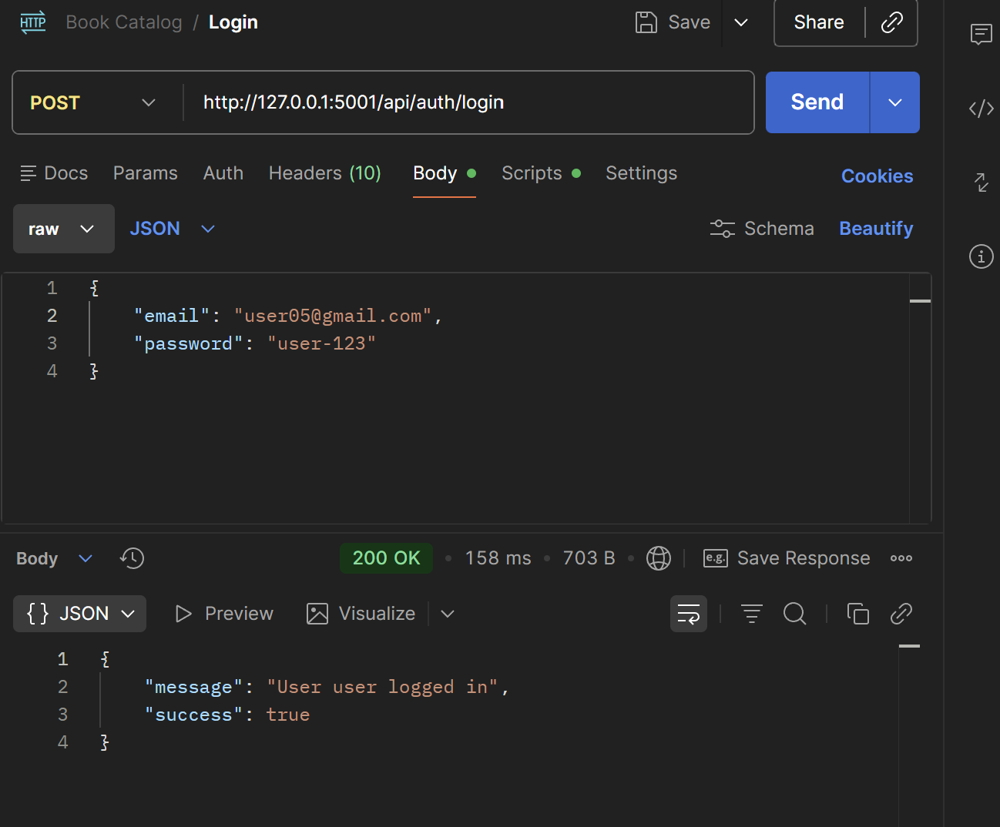
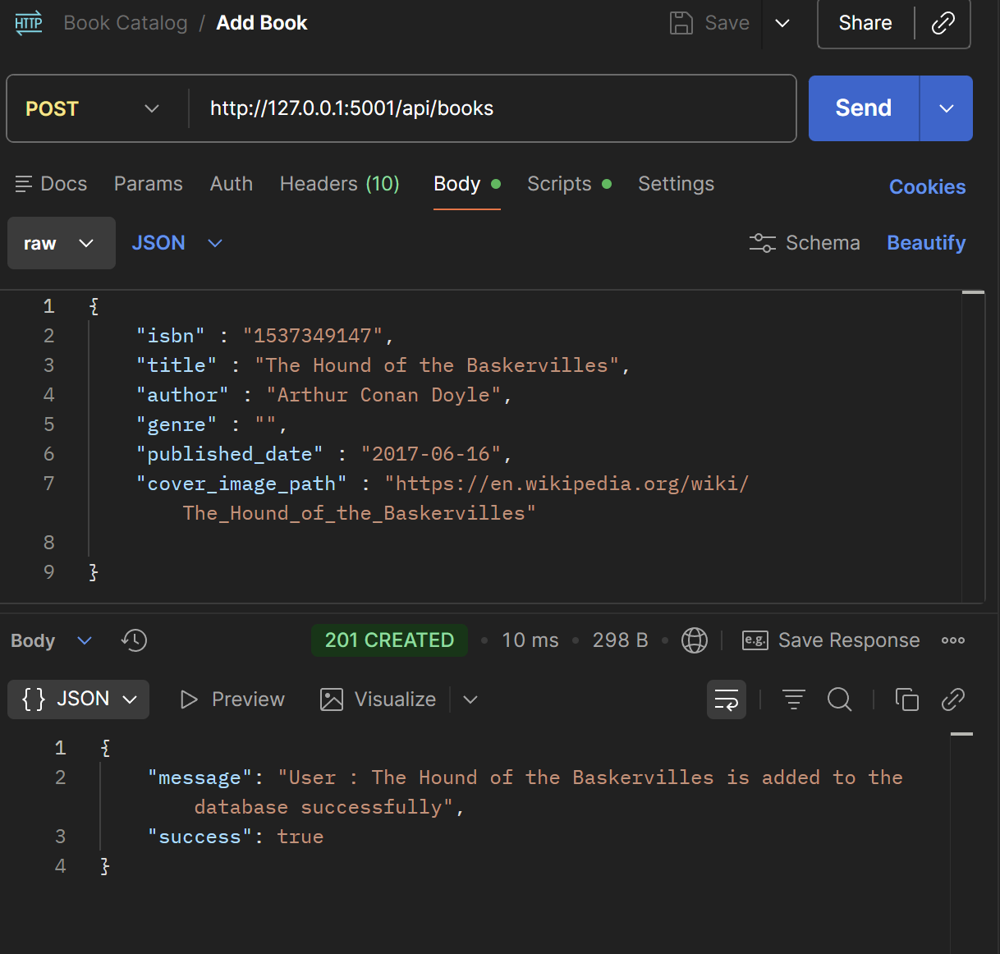
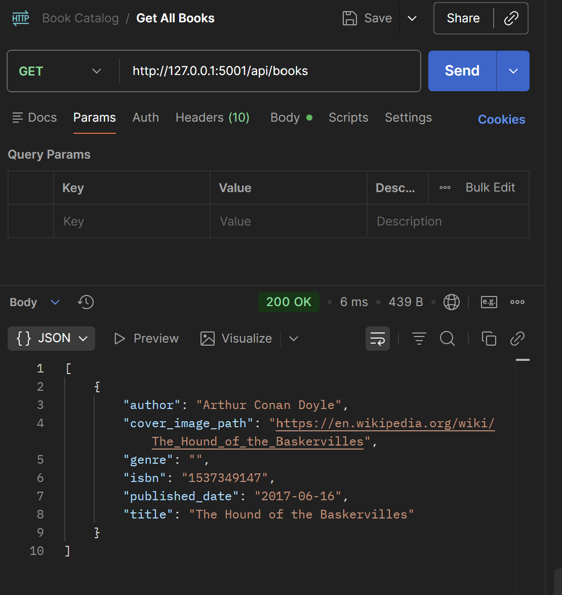
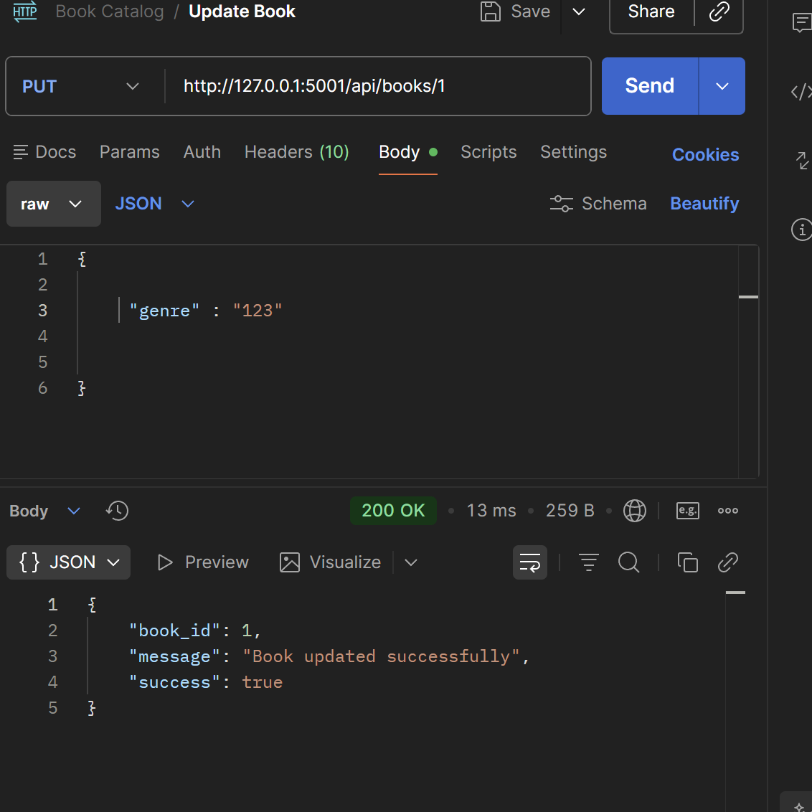
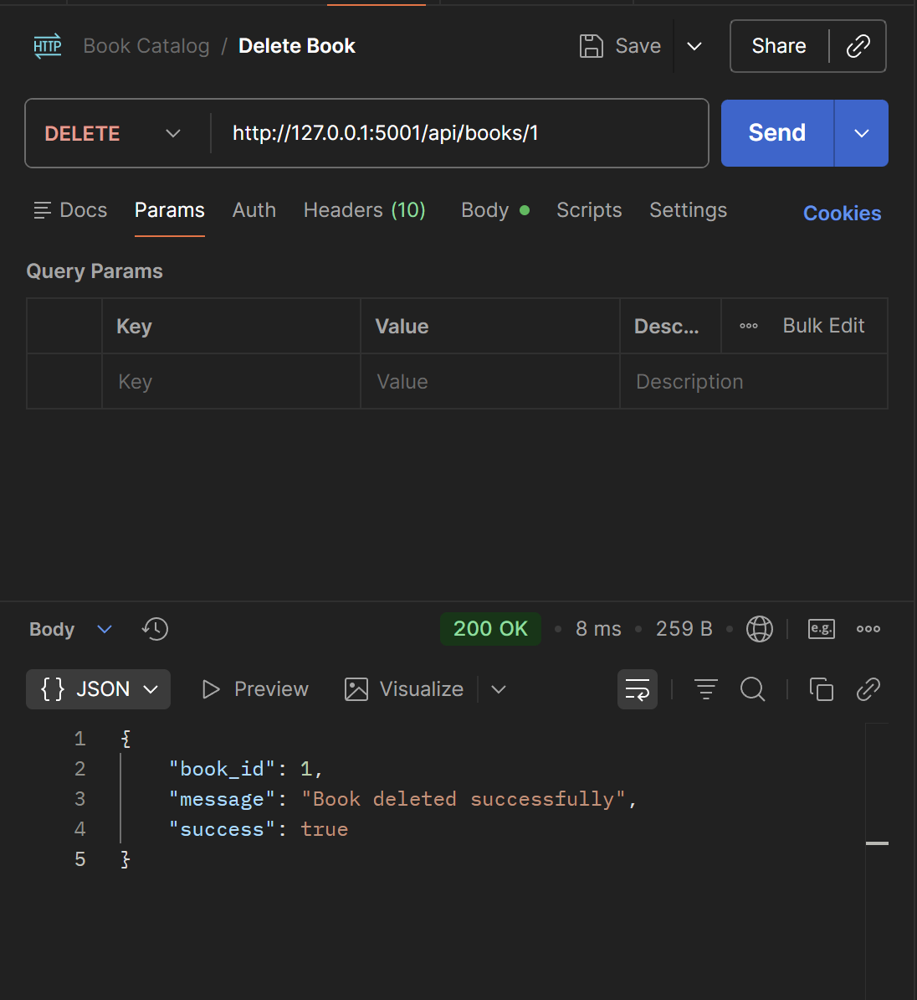
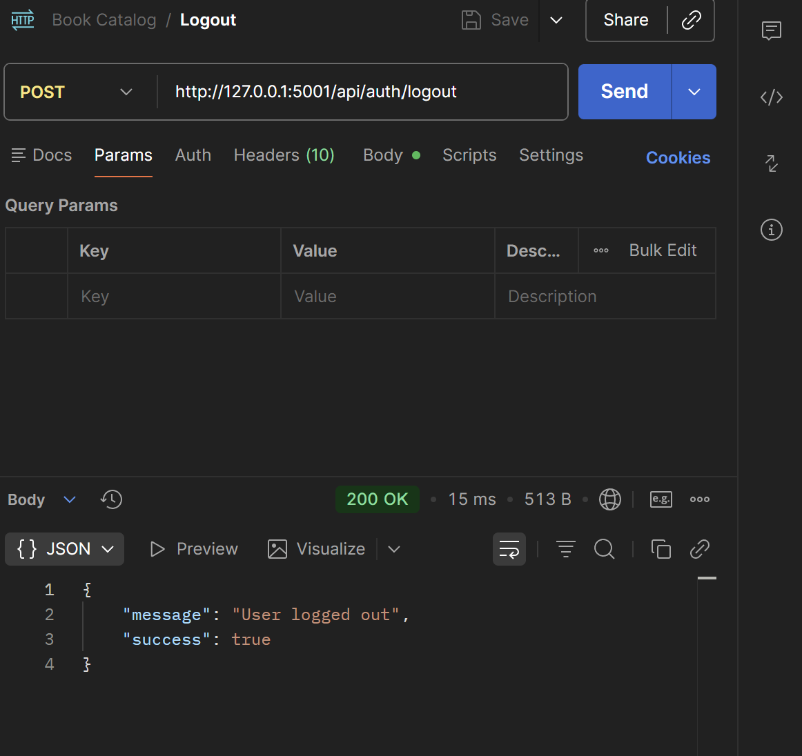

# **Book Catalog API**

This is a repository containing a sample readme file.

---

## **Description**
This is a Flask API. It has the following properties:
    1. User
    2. Book
   A user can create an accout, login logout. After login users can add a book to database,
   edite existing book, get a list of all books, and delete books form database.


---

## Installation and Set Up
Clone the repo from GitHub:
```
git clone https://github.com/alhaj05322/book-catalog-api.git
```

Navigate to the root folder:
```
cd book-catalog-api
```

Install the required packages:
```
pip install -r requirements.txt
```

Create the database
```
python create_db.py
```


## Launching the Program
Run ```flask run```. You may use [Postman](https://chrome.google.com/webstore/detail/postman/fhbjgbiflinjbdggehcddcbncdddomop?hl=en) for Google Chrome to run the API.

## API Endpoints

| Resource URL | Methods | Description | Requires Login |
| -------- | ------------- | --------- |--------------- |
| `/api` | GET  | The index | FALSE |
| `/api/auth/register` | POST  | User registration | FALSE |
|  `/api/auth/login` | POST | User login | FALSE |
|  `/api/auth/logout` | POST | User logout | TRUE |
| `/api/books` | GET, POST | View all books, add a book | TRUE |
| `/api/books/<int:book_id>` | PUT, DELETE | edit, and delete a single book | TRUE |


## Sample API Requests

Registering a user:


User login


Add a book:


Displaying a list of books:


Updating a book:


Delete a book:


User Logout:



## **Contact Information**

- Email: alhaj05322@gmail.com
- GitHub: https://github.com/alhaj05322

